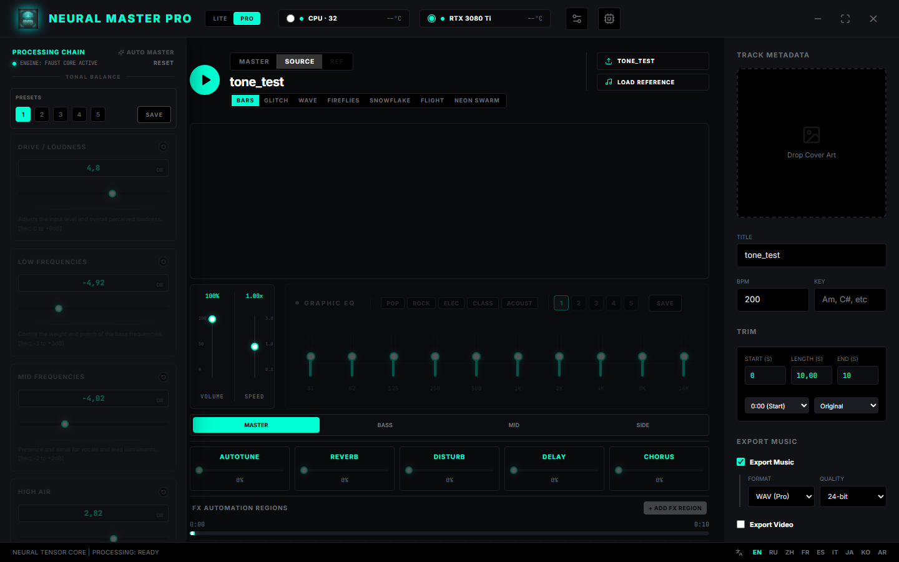
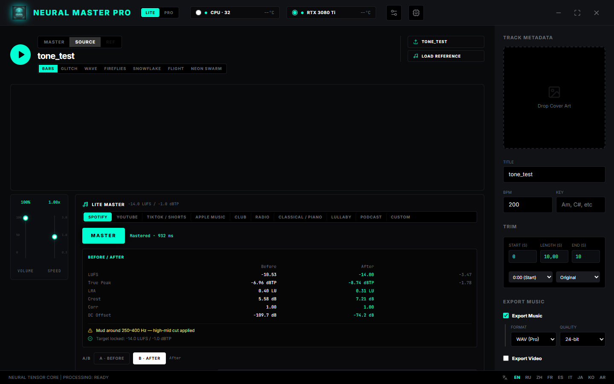
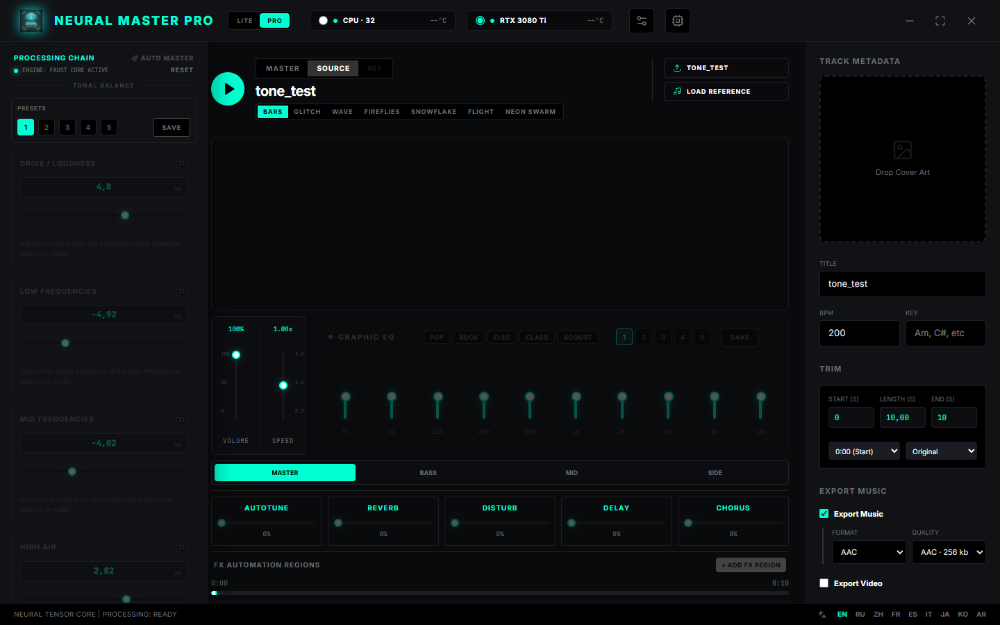
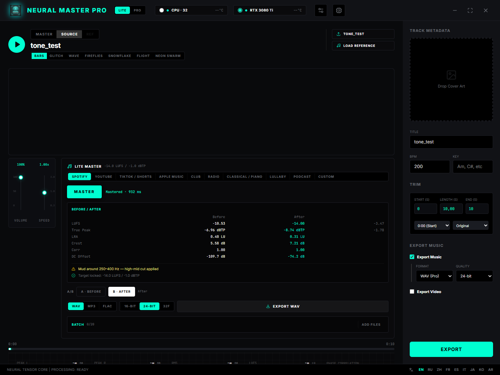
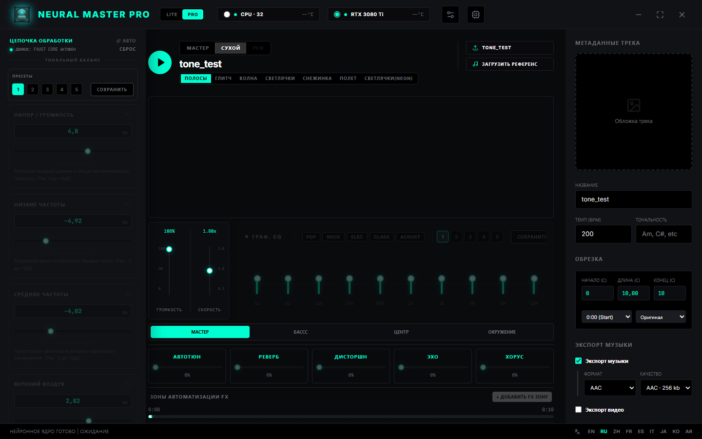
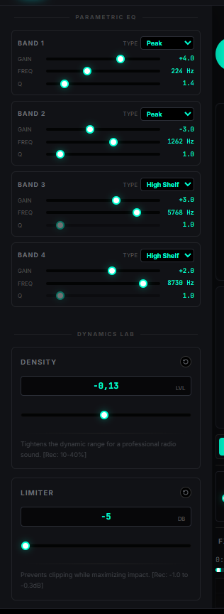
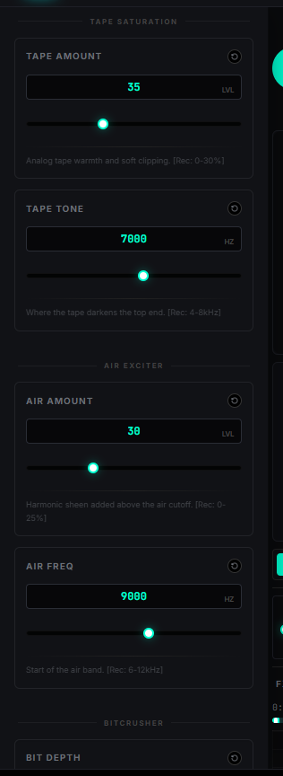
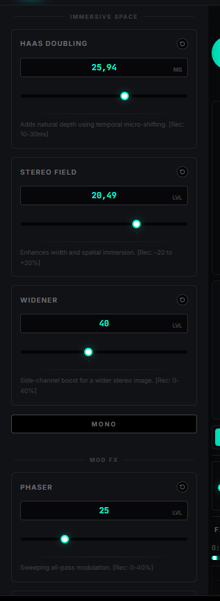
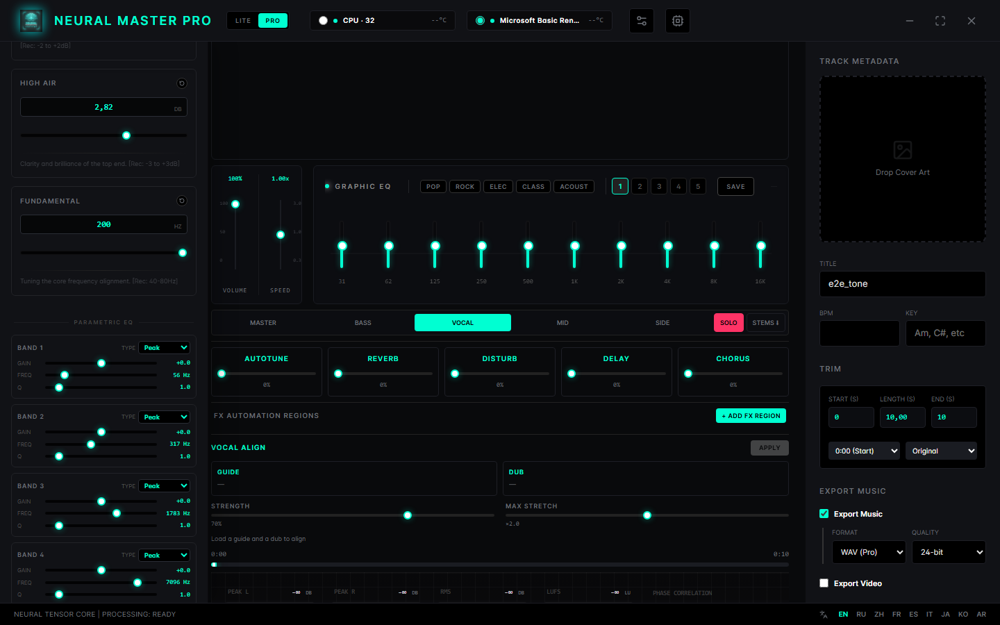
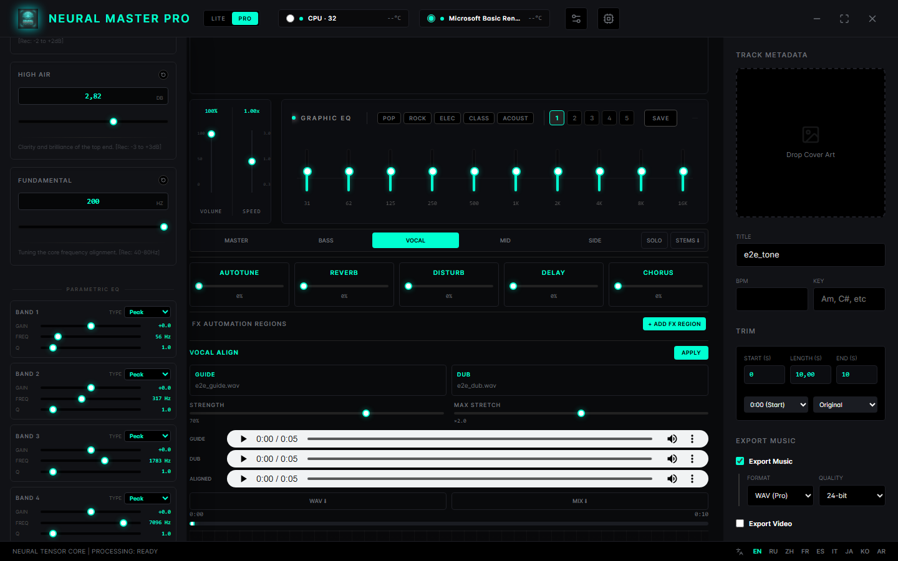

# Neural Master Pro 2.5

**100% offline AI-music mastering.** Turn AI-generated (or any other) tracks into release-ready masters — loudness, true peak and tone dialed to each platform's requirements — without a single byte leaving your device.

| | |
|---|---|
|  |  |
|  |  |
|  |  |
|  |  |
|  |  |

## Why

Platforms (Spotify, Apple Music, YouTube, TikTok…) reject or demonetize tracks that miss their loudness and peak requirements. AI music tools are great at writing songs — and their raw output usually lands too quiet, clipped, or muddy for a real release. Neural Master Pro closes that gap, locally.

## Features

- **Lite — one-click mastering**: 10 platform presets (Spotify, YouTube, TikTok/Shorts, Apple Music, Club, Radio, Classical/Piano, Lullaby, Podcast, Custom with your own LUFS target / ceiling / profile). Real-time analysis reports what it did: mud around 250–400 Hz, harshness at 3–5 kHz, loudness locked to target, true peak under the ceiling.
- **Honest BS.1770-4 metrics**: integrated LUFS, true peak (4× oversampled), LRA, crest factor, phase correlation, DC offset — shown as a Before/After table with deltas.
- **A/B compare**: hold to audition the original or the mastered take, sample-synced.
- **Pro — realtime mixer**: Faust-based DSP engine: tonal balance (drive / lows / mids / high air), graphic EQ + 4-band parametric EQ, FX (autotune, reverb, distortion, delay, chorus) + 10 VST-class modules (bus compressor, noise gate, transient shaper, de-esser, tape saturation, air exciter, bitcrusher, stereo widener + MONO, phaser, flanger, tremolo), FX automation regions, 7 visualizer modes.
- **Stem Studio**: solo-audition each stem — Bass, Vocal, Mid, Side (center-band crossover + M/S reconstruction, deterministic DSP, not ML separation) — dial per-stem FX (5 dedicated vocal FX), and export all four stems as a WAV ZIP.
- **Vocal Align**: upload a guide and a double, and the dub is time-mapped onto the guide's phrasing (envelope onset matching + WSOLA stretching — pitch preserved); strength and max-stretch guards, aligned WAV / guide+aligned mix download.
- **Pexels backgrounds cut on peaks**: stock-video backgrounds (bring your own free API key) switch clips on the track's detected audio peaks with crossfades — video editing that follows the music.
- **Batch mode**: queue up to 20 files, per-file progress, one-click ZIP export of all masters.
- **Reference matching**: load a reference track and match its integrated loudness.
- **Export**: WAV 16/24/32-bit float, MP3 192/320 kbps, FLAC, AAC 128/256 kbps (m4a, with title/artist metadata) — plus visualizer video export. All encoding happens locally.
- **9 languages**: English, Russian, Chinese, Italian, French, Spanish, Japanese, Korean, Arabic.
- **Private by design**: 100% client-side. Your audio files are never uploaded. No accounts, no cloud, no telemetry.

## Requirements

- Windows 10/11 x64
- No internet connection needed — the app is fully offline

## Download

Grab the latest build from [GitHub Releases](https://github.com/Prophetic-Helgy/neural-master-pro/releases):

- **Portable** — single EXE, no installation
- **Installer** — NSIS setup

Every release lists a SHA-256 checksum per file. Verify with:

```powershell
Get-FileHash .\Neural.Master.Pro.2.5.Setup.2.5.0.exe -Algorithm SHA256
```

## Build from source

```bash
npm install
npm run dev        # Vite dev loop on http://localhost:3000
npm run build:exe  # portable + NSIS installer into release/
```

## License

Proprietary, source publicly available — see [LICENSE](LICENSE). Free for personal, non-commercial use; redistribution, reselling and bundling are not permitted. **Commercial use requires a separate license from the author (dual-licensing)** — get in touch to arrange one. Any audio you process with the Software is 100% yours.

---

**Author:** Oleg Abezov
**Telegram:** [@DunkanMcLeod](https://t.me/DunkanMcLeod)
**Instagram:** [@only_monochrome](https://instagram.com/only_monochrome)

---

# Neural Master Pro 2.5 (RU)

**Полностью офлайн-мастеринг AI-музыки.** Превращает треки, созданные нейросетями (или любые другие), в релизные мастер-копии — громкость, true peak и тон точно под требования площадок — ни один байт не покидает ваше устройство.

## Зачем

Площадки (Spotify, Apple Music, YouTube, TikTok…) отклоняют или демонетизируют треки, не дотягивающие до требований по громкости и пикам. AI-инструменты отлично пишут музыку — но их сырые выводы обычно слишком тихие, перегруженные или мутные для настоящего релиза. Neural Master Pro закрывает этот разрыв локально.

## Возможности

- **Lite — мастеринг в один клик**: 10 пресетов площадок (Spotify, YouTube, TikTok/Shorts, Apple Music, Club, Radio, Classical/Piano, Lullaby, Podcast, Custom — свои LUFS / потолок / профиль). Анализ в реальном времени показывает, что сделано: муть в 250–400 Гц, жёсткость на 3–5 кГц, громкость зафиксирована по цели, true peak под потолком.
- **Честные метрики BS.1770-4**: интегрированный LUFS, true peak (4× oversampling), LRA, crest factor, фазовая корреляция, DC-offset — таблица Before/After с дельтами.
- **A/B-сравнение**: зажмите кнопку, чтобы услышать оригинал или мастер — синхронно по сэмплам.
- **Pro — realtime-микшер**: DSP-движок на Faust: тон (drive / lows / mids / high air), графический + 4-полосный параметрический EQ, эффекты (autotune, reverb, distortion, delay, chorus) + 10 VST-модулей (bus-компрессор, noise gate, transient shaper, деэссер, tape saturation, air exciter, bitcrusher, widener + MONO, phaser, flanger, tremolo), регионы автоматизации FX, 7 режимов визуализатора.
- **Stem Studio**: соло-прослушка стемов — Bass, Vocal, Mid, Side (кроссовер центральной полосы + M/S-реконструкция, детерминированный DSP, без ML-разделения), отдельные FX для каждого стема (5 эффектов вокала) и экспорт всех четырёх стемов ZIP-архивом WAV'ов.
- **Vocal Align**: загрузите гайд и дубль — дубль по времени подтягивается к фразировке гайда (совпадение onset-огибаемых + WSOLA-растяжение с сохранением высоты тона); регуляторы силы и макс. растяжения, скачивание выровненного WAV и микса гайд+align.
- **Фоны Pexels по пикам**: стоковые видео-фоны (нужен ваш бесплатный API-ключ) переключаются по детектированным пикам аудио с кроссфейдами — видеомонтаж, следующий за музыкой.
- **Batch-режим**: очередь до 20 файлов, прогресс по каждому, ZIP-экспорт всех мастеров одним кликом.
- **Сопоставление с референсом**: загрузите референс-трек и подгоните интегрированную громкость.
- **Экспорт**: WAV 16/24/32-bit float, MP3 192/320 kbps, FLAC, AAC 128/256 kbps (m4a, с метаданными title/artist) + видео-визуализация. Всё кодирование — локально.
- **9 языков**: EN, RU, ZH, IT, FR, ES, JA, KO, AR.
- **Приватность по конструкции**: 100% client-side. Аудиофайлы никогда не загружаются: без аккаунтов, облака и телеметрии.

## Требования

- Windows 10/11 x64, интернет не требуется

## Загрузка

Актуальные сборки — в [GitHub Releases](https://github.com/Prophetic-Helgy/neural-master-pro/releases): **portable** (один EXE, без установки) и **инсталлятор** (NSIS). К каждому файлу — SHA-256-контрольная сумма.

## Сборка из исходников

```bash
npm install
npm run dev        # Vite-цикл разработки на http://localhost:3000
npm run build:exe  # portable + NSIS-инсталлятор в release/
```

## Лицензия

Проприетарная, исходники в открытом доступе — см. [LICENSE](LICENSE). Бесплатно для личного некоммерческого использования; перераспространение, перепродажа и включение в другие продукты запрещены. **Коммерческое использование — по отдельной лицензии автора (dual-licensing)** — свяжитесь для договорённости. Любое обработанное вами аудио — 100% ваше.
